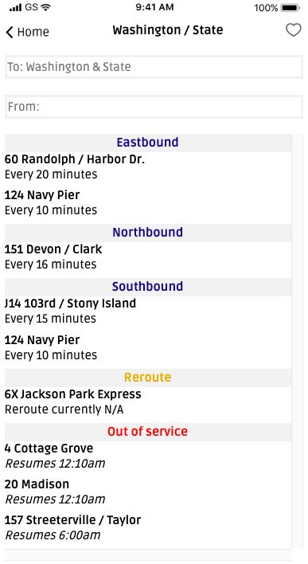

# hello-bloc-busy-bus

I applied newly-acquired frontend skills to build bus routes view for an independent project called 'BusyBus.'

The expectations were two-fold; 1. Accurately utilize HTML and CSS to build a solution that is responsive. 2. Deploy project to Github.

